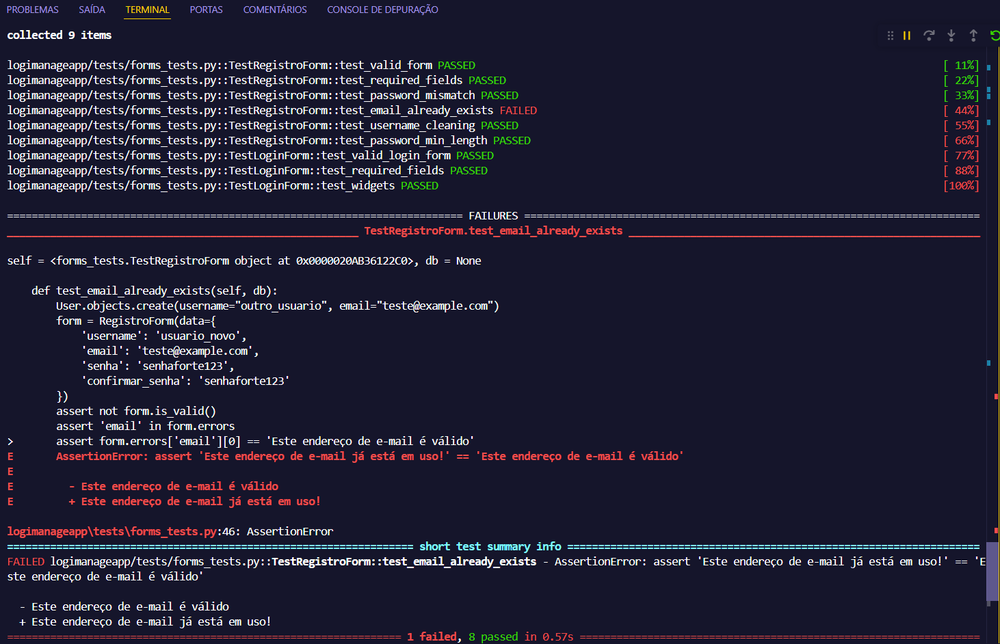

# Plano de Testes - LogiManage

## 1. Plano de Teste
### 1.1. Plano de Teste
Sistema de Gerenciamento de Transportes
### 1.2. Objetivo
Garantir que o sistema permita um cadastro e login seguro.
### 1.3. Escopo
Testar a funcionalidade de cadastro e login com credenciais válidas e inválidas.
### 1.4. Estratégia
Testes manuais e automatizados usando Pytest e validadores Django forms.
### 1.5. Recursos
Banco de dados SQLite3, VSCode, Pytest, Python, Django.
### 1.6. Riscos 
- Banco de Dados Não Configurado ou Inacessível
Como os testes usam @pytest.mark.django_db, é necessário que o banco de dados esteja acessível. Se o banco não estiver configurado corretamente, os testes falharão.
- Execução de Testes em um Banco de Dados de Produção
Se pytest for executado em um banco de produção por engano, pode causar perda de dados. Django normalmente bloqueia esse comportamento, mas é um risco se settings.DATABASES não estiver bem configurado.
- Migrações Não Aplicadas
Se as migrações do Django não estiverem atualizadas (python manage.py migrate), os testes podem falhar ao tentar acessar modelos que não existem no esquema do banco de dados.
- Testes Paralelos e Concorrência
Se os testes forem executados simultaneamente (com pytest-xdist por exemplo), podem surgir conflitos de escrita no banco de testes.
- Dependência de Configurações Externas
Se alguma configuração necessária para os formulários depender de arquivos externos (settings.py, .env), isso pode impedir a execução dos testes.
- Mensagens de Erro e Localização
Se o Django estiver configurado para usar tradução dinâmica (gettext), as mensagens de erro podem variar dependendo do idioma, fazendo com que os testes falhem.
### 1.7. Cronograma
20/03/2025 - 27/03/2025
## 2. Casos de Teste
### **ID: CT-001**  
**Descrição:** Validação de um formulário de registro com dados válidos.  
**Pré-condições:** O sistema deve estar operacional.  
**Passos:**  
1. Preencher o formulário de registro com os seguintes dados:  
   - Username: usuario_teste  
   - Email: teste@example.com  
   - Senha: senhaforte123  
   - Confirmar Senha: senhaforte123  
2. Submeter o formulário.  
**Resultado Esperado:** O formulário deve ser válido.  
**Resultado Obtido:** O formulário foi validado corretamente.

---

### **ID: CT-002**  
**Descrição:** Validação de campos obrigatórios no formulário de registro.  
**Pré-condições:** O sistema deve estar operacional.  
**Passos:**  
1. Deixar todos os campos do formulário de registro vazios.  
2. Submeter o formulário.  
**Resultado Esperado:** O formulário deve ser inválido e exibir mensagens de erro para os campos ausentes.  
**Resultado Obtido:** O formulário foi considerado inválido e exibiu mensagens de erro para os campos obrigatórios.

---

### **ID: CT-003**  
**Descrição:** Validação de senhas diferentes no formulário de registro.  
**Pré-condições:** O sistema deve estar operacional.  
**Passos:**  
1. Preencher o formulário de registro com:  
   - Username: usuario_teste  
   - Email: teste@example.com  
   - Senha: senhaforte123  
   - Confirmar Senha: outrasenha123  
2. Submeter o formulário.  
**Resultado Esperado:** O formulário deve ser inválido e exibir uma mensagem indicando que as senhas não coincidem.  
**Resultado Obtido:** O formulário foi considerado inválido e exibiu a mensagem correta sobre a incompatibilidade das senhas. 

---

### **ID: CT-004**  
**Descrição:** Validação de e-mail já cadastrado no formulário de registro.  
**Pré-condições:** Um usuário já cadastrado com o e-mail "teste@example.com".  
**Passos:**  
1. Criar um usuário com o e-mail "teste@example.com".  
2. Preencher o formulário de registro com:  
   - Username: usuario_novo  
   - Email: teste@example.com  
   - Senha: senhaforte123  
   - Confirmar Senha: senhaforte123  
3. Submeter o formulário.  
**Resultado Esperado:** O formulário deve ser inválido e exibir uma mensagem de erro informando que o e-mail já está em uso.  
**Resultado Obtido:** O formulário foi considerado inválido e exibiu a mensagem correta sobre o e-mail já estar cadastrado.

---

### **ID: CT-005**  
**Descrição:** Validação da limpeza do nome de usuário no formulário de registro.  
**Pré-condições:** O sistema deve estar operacional.  
**Passos:**  
1. Preencher o formulário de registro com:  
   - Username: "  usuario com espaco  "  
   - Email: teste@example.com  
   - Senha: senhaforte123  
   - Confirmar Senha: senhaforte123  
2. Submeter o formulário.  
**Resultado Esperado:** O nome de usuário deve ser salvo como "usuario_com_espaco" sem espaços extras.  
**Resultado Obtido:** O nome de usuário foi processado corretamente e salvo sem espaços extras.

---

### **ID: CT-006**  
**Descrição:** Validação de senha curta no formulário de registro.  
**Pré-condições:** O sistema deve estar operacional.  
**Passos:**  
1. Preencher o formulário de registro com:  
   - Username: usuario_teste  
   - Email: teste@example.com  
   - Senha: 123  
   - Confirmar Senha: 123  
2. Submeter o formulário.  
**Resultado Esperado:** O formulário deve ser inválido e exibir uma mensagem informando que a senha deve ter pelo menos 8 caracteres.  
**Resultado Obtido:** O formulário foi considerado inválido e exibiu a mensagem correta sobre a exigência do tamanho mínimo da senha. 

---

### **ID: CT-007**  
**Descrição:** Validação de um formulário de login com dados válidos.  
**Pré-condições:** O sistema deve estar operacional.  
**Passos:**  
1. Preencher o formulário de login com:  
   - Username: usuario_teste  
   - Senha: senhaforte123  
2. Submeter o formulário.  
**Resultado Esperado:** O formulário deve ser válido.  
**Resultado Obtido:** O formulário foi validado corretamente.

---

### **ID: CT-008**  
**Descrição:** Validação de campos obrigatórios no formulário de login.  
**Pré-condições:** O sistema deve estar operacional.  
**Passos:**  
1. Deixar todos os campos do formulário de login vazios.  
2. Submeter o formulário.  
**Resultado Esperado:** O formulário deve ser inválido e exibir mensagens de erro para os campos ausentes.  
**Resultado Obtido:** O formulário foi considerado inválido e exibiu mensagens de erro para os campos obrigatórios.

---

### **ID: CT-009**  
**Descrição:** Validação dos widgets dos campos no formulário de login.  
**Pré-condições:** O sistema deve estar operacional.  
**Passos:**  
1. Inicializar o formulário de login.  
2. Verificar os tipos de widgets dos campos.  
**Resultado Esperado:** O campo "username" deve utilizar um widget `TextInput` e o campo "password" deve utilizar um widget `PasswordInput`.  
**Resultado Obtido:** Os widgets foram configurados corretamente no formulário.

## 3. Relatórios de Teste
### **ID: CT-001**  
**Status:** ✅ Passou  
**Erro encontrado:** Nenhum  
**Responsável:** João Evangelista  
**Data:** 20/03/2025  

---

### **ID: CT-002**  
**Status:** ✅ Passou  
**Erro encontrado:** Nenhum  
**Responsável:** João Evangelista  
**Data:** 20/03/2025  

---

### **ID: CT-003**  
**Status:** ✅ Passou  
**Erro encontrado:** Nenhum  
**Responsável:** João Evangelista  
**Data:** 20/03/2025  

---

### **ID: CT-004**  
**Status:** ❌ Falhou  
**Erro encontrado:** O erro retornado pelo sistema não corresponde ao esperado.  
  - **Esperado:** `'Este endereço de e-mail já está em uso!'`  
  - **Obtido:** `'Este endereço de e-mail é válido'`  
**Responsável:** João Evangelista  
**Data:** 20/03/2025  

---

### **ID: CT-005**  
**Status:** ✅ Passou  
**Erro encontrado:** Nenhum  
**Responsável:** João Evangelista  
**Data:** 20/03/2025  

---

### **ID: CT-006**  
**Status:** ✅ Passou  
**Erro encontrado:** Nenhum  
**Responsável:** João Evangelista  
**Data:** 20/03/2025  

---

### **ID: CT-007**  
**Status:** ✅ Passou  
**Erro encontrado:** Nenhum  
**Responsável:** João Evangelista  
**Data:** 20/03/2025  

---

### **ID: CT-008**  
**Status:** ✅ Passou  
**Erro encontrado:** Nenhum  
**Responsável:** João Evangelista  
**Data:** 20/03/2025  

---

### **ID: CT-009**  
**Status:** ✅ Passou  
**Erro encontrado:** Nenhum  
**Responsável:** João Evangelista  
**Data:** 20/03/2025  

