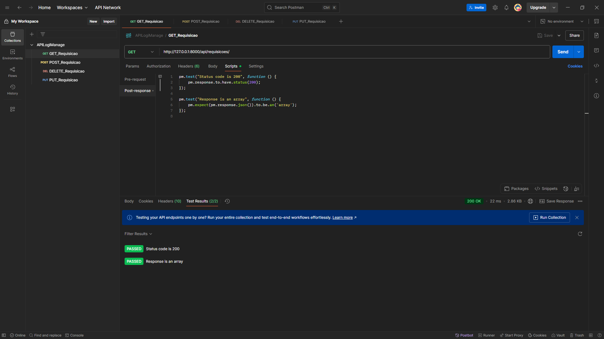
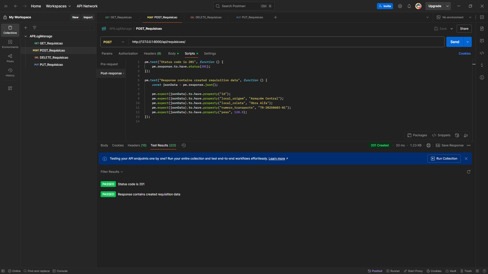
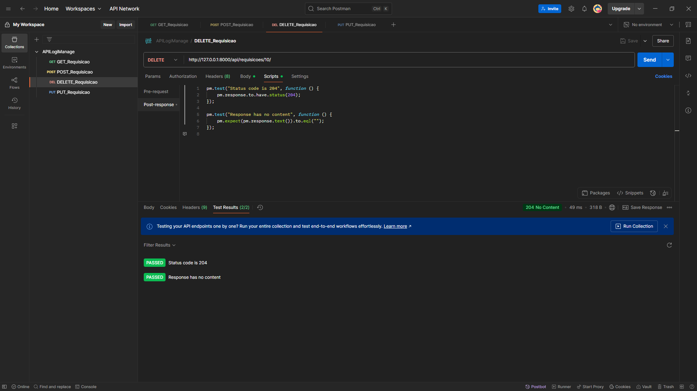

# Relatório de Teste de API: Módulo de Requisições (API.rqdManage)

**Autor:** João Victor Evangelista Lopes Ribeiro  
**Data da Análise:** 02 de Junho de 2025

---

## 1. Introdução

Este documento apresenta os resultados de testes de validação funcional para a API do módulo de requisições (`API.rqdManage`). O objetivo primário foi verificar a conformidade dos endpoints com as operações CRUD (Create, Read, Update, Delete) esperadas para o recurso `/requisicoes`, analisando os códigos de status HTTP e a estrutura das respostas.

**Ferramentas e Tecnologias Utilizadas:**
* **Cliente de API:** Postman
* **Linguagem de Programação:** Python
* **Framework Backend:** Django
* **Extensão API:** Django Rest Framework (DRF)
* **Coleção Testada:** `API.rqdManage`

---

## 2. Metodologia de Teste

Os testes foram conduzidos utilizando a ferramenta Postman, com a execução de requisições HTTP para cada endpoint do recurso `/requisicoes`. Para cada teste, foram avaliados o código de status HTTP retornado e a conformidade do corpo da resposta com o esperado.

---

## 3. Resultados dos Testes

### 3.1. GET /requisicoes

* **Descrição:** Este teste visa validar a capacidade da API de recuperar uma coleção de todas as requisições cadastradas no sistema.
* **Método HTTP:** `GET`
* **URL:** `http://127.0.0.1:8000/api/requisicoes/`

| Critério de Validação | Resultado | Observações Detalhadas                                  |
| :-------------------- | :-------- | :------------------------------------------------------ |
| Status Code `200 OK`  | ✅ PASSOU | A requisição retornou o status `200 OK`, indicando sucesso na operação. |
| Resposta em Formato de Array | ✅ PASSOU | O corpo da resposta foi validado como um array JSON, consistente com a recuperação de uma coleção de recursos. |

  
   
  <em>Figura 3.1: Resultado do teste GET /requisicoes no Postman.</em>

### 3.2. POST /requisicoes

* **Descrição:** Este teste verifica a funcionalidade de criação de uma nova requisição na API.
* **Método HTTP:** `POST`
* **URL:** `http://127.0.0.1:8000/api/requisicoes/`

| Critério de Validação              | Resultado | Observações Detalhadas                                                                                               |
| :--------------------------------- | :-------- | :------------------------------------------------------------------------------------------------------------------- |
| Status Code `201 Created`          | ✅ PASSOU | A requisição retornou o status `201 Created`, confirmando a criação bem-sucedida do recurso.                      |
| Resposta Contém Dados da Requisição Criada | ✅ PASSOU | O corpo da resposta incluiu as propriedades da requisição recém-criada (e.g., `id`, `local_origem`, `local_coleta`), validando a integridade dos dados. |

  
   
  <em>Figura 3.2: Resultado do teste POST /requisicoes no Postman.</em>

### 3.3. PUT /requisicoes/:id

* **Descrição:** Este teste avalia a capacidade da API de atualizar os dados de uma requisição específica.
* **Método HTTP:** `PUT`
* **URL:** `http://127.0.0.1:8000/api/requisicoes/8/` (Exemplo com ID `8`)

| Critério de Validação              | Resultado | Observações Detalhadas                                                                                               |
| :--------------------------------- | :-------- | :------------------------------------------------------------------------------------------------------------------- |
| Status Code `200 OK`               | ✅ PASSOU | A requisição retornou o status `200 OK`, indicando a atualização bem-sucedida do recurso.                            |
| Resposta Contém Dados Atualizados | ✅ PASSOU | O corpo da resposta refletiu as modificações aplicadas à requisição, confirmando a atualização de dados (e.g., `local_origem` ajustado). |

  
   
  <em>Figura 3.3: Resultado do teste PUT /requisicoes/:id no Postman.</em>

### 3.4. DELETE /requisicoes/:id

* **Descrição:** Este teste verifica a funcionalidade de remoção de uma requisição do sistema.
* **Método HTTP:** `DELETE`
* **URL:** `http://127.0.0.1:8000/api/requisicoes/10/` (Exemplo com ID `10`)

| Critério de Validação      | Resultado | Observações Detalhadas                                                                                                |
| :------------------------- | :-------- | :-------------------------------------------------------------------------------------------------------------------- |
| Status Code `204 No Content` | ✅ PASSOU | A requisição retornou o status `204 No Content`, o código padrão para exclusões bem-sucedidas que não retornam um corpo de resposta. |
| Resposta Sem Conteúdo      | ✅ PASSOU | O corpo da resposta estava vazio, conforme esperado para o status `204`.                                            |

  
   
  <em>Figura 3.4: Resultado do teste DELETE /requisicoes/:id no Postman.</em>

---

## 4. Conclusão

Os testes realizados nos endpoints `GET`, `POST`, `PUT` e `DELETE` da API `API.rqdManage` foram concluídos com sucesso. Todos os códigos de status HTTP retornados estiveram em conformidade com as expectativas para cada operação CRUD, e a estrutura e o conteúdo das respostas foram validados positivamente.

A API demonstra uma implementação robusta e funcional das operações básicas para o recurso `/requisicoes`, atuando conforme o projetado para a manipulação de dados.

---